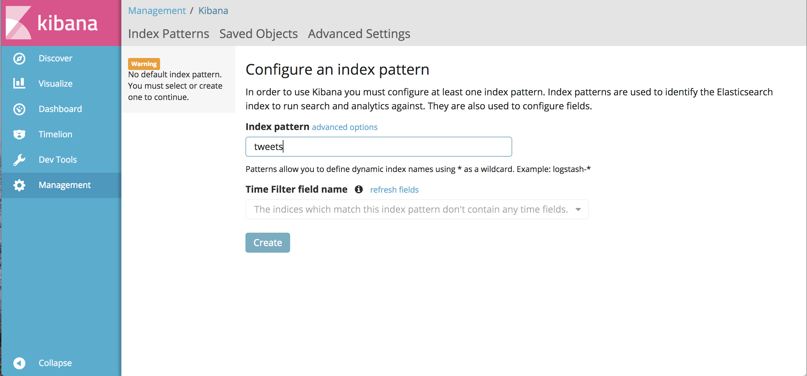
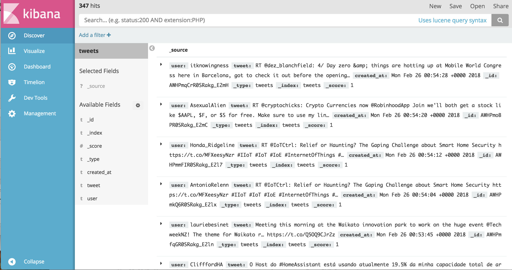

# Realtime tweets collector by Hashtags
-------------------------------------

### Systems/Containers used
    - Log database: Elasticsearch
    - Web UI: Kibana
    - Tweet listener: Written on Python

### Prerequisities:
    - Docker Engine
    - Docker-Compose

### Steps to run:
`$ git clone https://github.com/sizgiyaev/twitter-analysis-test.git`  
`$ cd twitter-analysis-test`
* Prior to start configure Twitter credentials in config.env file
```
TWITTER_CONSUMER_KEY=<twitter_account_consumer_key>  
TWITTER_CONSUMER_SECRET=<twitter_account_consumer_secret>  
TWITTER_ACCESS_TOKEN=<twitter_account_access_token>  
TWITTER_ACCESS_TOKEN_SECRET=<twitter_account_access_token_secret>  
TWITTER_HASHTAGS=#laundering,#money,#security,#iot (Comma-separated monitored hashtags list)
```
`$ docker-compose up -d`  

* Once the stack is up, browse to http://localhost:5601 for Kibana WEB UI.
* Type tweets as index pattern and click on create.


* Navigate to Discover to see tweets that are being collected.
